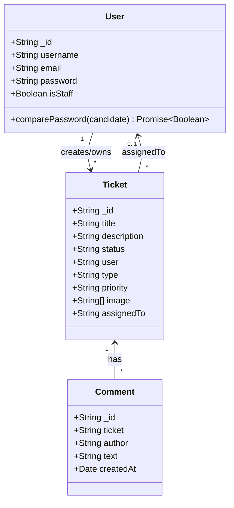
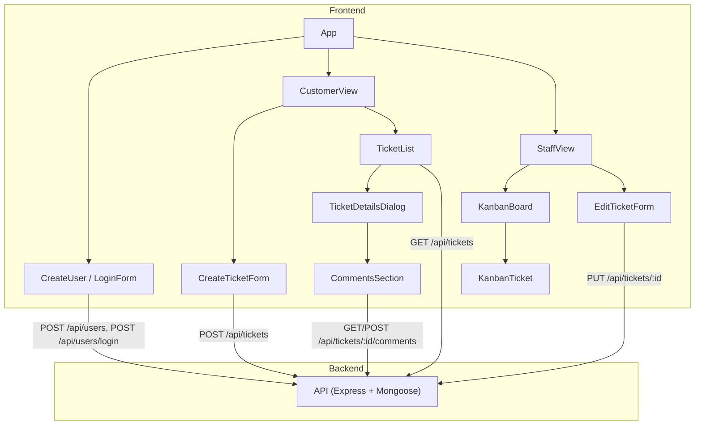
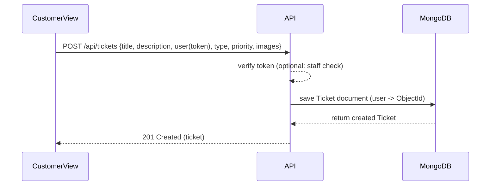
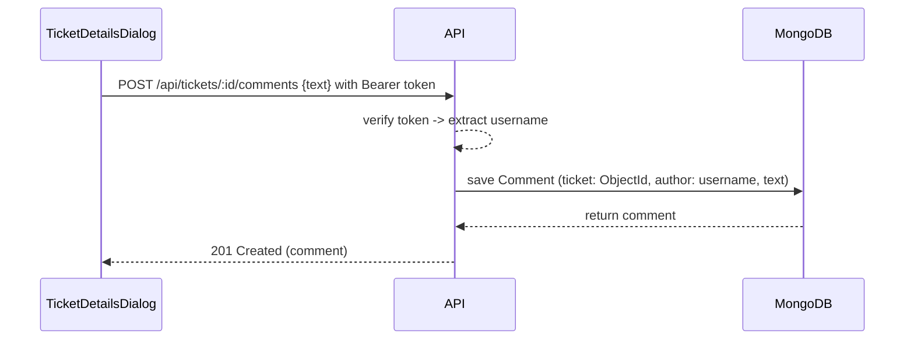

# UML Diagrams (Mermaid)

## 1) Class Diagram — Data models

## 2) Component Diagram — Frontend ↔ API

This maps key React components to the API endpoints they use.

---

## 3) API Endpoints Reference (summary)

- Users:
  - `POST /api/users` — create user (returns token + user)
  - `POST /api/users/login` — login (returns token + user)
  - `GET /api/users` — get current user (requires Bearer token)
  - `GET /api/users/:id` — get public user info
  - `GET /api/users/staff/list` — list staff users
  - `DELETE /api/users/:id` — delete user

- Tickets:
  - `GET /api/tickets` — list tickets (staff: all, customer: own)
  - `POST /api/tickets` — create ticket (multipart images)
  - `PUT /api/tickets/:id` — update ticket (assign, edit, images)
  - `DELETE /api/tickets/:id` — delete ticket

- Comments:
  - `GET /api/tickets/:ticketId/comments` — list comments for ticket
  - `POST /api/tickets/:ticketId/comments` — add comment (auth required)

---

## 4) Sequence Diagram — Create Ticket (Customer)

## 5) Sequence Diagram — Add Comment

